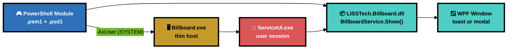
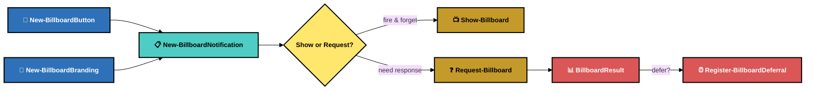

<p align="center">
  
</p>

<p align="center">
  
</p>

<h1 align="center">Billboard</h1>
<p align="center">
  <strong>Rich WPF notifications for Windows endpoints — toast &amp; modal, dark &amp; light, scriptable via PowerShell</strong>
</p>

<p align="center">
  <a href="https://www.powershellgallery.com/packages/LISSTech.Billboard"></a>
  
  
  
  
  
</p>

<p align="center">
  <a href="#-quick-start"><b>Quick Start</b></a> · <a href="#%EF%B8%8F-architecture"><b>Architecture</b></a> · <a href="#-powershell-api"><b>PowerShell API</b></a> · <a href="#-notification-types"><b>Types</b></a> · <a href="#-exe-host"><b>Exe Host</b></a> · <a href="#-building"><b>Building</b></a> · <a href="#-project-structure"><b>Structure</b></a>
</p>

---

## 📑 Table of Contents

- [⚡ Quick Start](#-quick-start)
- [🏗️ Architecture](#%EF%B8%8F-architecture)
- [🎮 PowerShell API](#-powershell-api)
- [🎨 Notification Types](#-notification-types)
- [⚙️ Exe Host](#%EF%B8%8F-exe-host)
- [🔨 Building](#-building)
- [📁 Project Structure](#-project-structure)

---

## ⚡ Quick Start

```powershell
# Install from PSGallery
Install-Module LISSTech.Billboard

# Fire-and-forget toast
Show-Billboard (New-BillboardNotification -Type Info `
    -Title 'Chrome Updated' `
    -Message 'Google Chrome has been updated to version **131.0.6778**.' `
    -Branding (New-BillboardBranding 'Contoso IT'))

# Modal that waits for user response
$result = Request-Billboard (New-BillboardNotification -Type Question `
    -Title 'Restart Required' `
    -Message 'A security update requires a restart.' `
    -Buttons @(
        New-BillboardButton 'Restart Now' -Value restart -Style Primary
        New-BillboardButton 'Remind in 4 Hours' -Value defer -Style Ghost -Defer 4h
    ) `
    -Branding (New-BillboardBranding 'Contoso IT') `
    -Modal)

$result.Value  # "restart" or "defer"
```

---

## 🏗️ Architecture



| Layer | Role | Details |
|-------|------|---------|
| 🎮 **PowerShell module** | User-facing API | Builder cmdlets (`New-Billboard*`) compose configs. Action cmdlets (`Show-Billboard`, `Request-Billboard`) display them. |
| 📦 **DLL** | Core engine | `BillboardService.Show()` manages the WPF Application lifecycle, creates windows, returns results. All UI, models, themes, and resources live here. |
| 🖥️ **Exe host** | SYSTEM bridge | Thin wrapper for ServiceUI scenarios. CLI args → `Show()` → named pipe → exit code. |
| 🔑 **ServiceUI** | Session injection | Microsoft tool that launches processes in the logged-on user's desktop session from SYSTEM context. |

> [!TIP]
> In user sessions, `Show-Billboard` calls the DLL directly — no exe, no pipe, no overhead. The exe path is only used when running as SYSTEM (e.g., Intune remediations, N-central scripts).

---

## 🎮 PowerShell API

### Builder Cmdlets

| Cmdlet | Description |
|--------|-------------|
| `New-BillboardButton` | Create a button with label, value, style (`Primary`, `Ghost`, `Danger`), and optional defer duration |
| `New-BillboardBranding` | Set organization name and optional logo path/URL |
| `New-BillboardNotification` | Compose a notification from type, title, message, buttons, branding, theme, timeout |

### Action Cmdlets

| Cmdlet | Description |
|--------|-------------|
| `Show-Billboard` | Display a notification. Fire-and-forget for toasts, blocks for modals. Use `-AsUser` from SYSTEM. |
| `Request-Billboard` | Display and wait for user response. Returns `BillboardResult` with button, value, defer. |
| `Register-BillboardDeferral` | Schedule a re-show via Windows Task Scheduler after a defer duration. |

### Notification Flow



### Parameters

```powershell
# Button styles: Primary, Ghost, Danger
New-BillboardButton 'OK' -Value ok -Style Primary

# Defer durations: 30m, 1h, 4h, 1d, 7d
New-BillboardButton 'Later' -Value defer -Style Ghost -Defer 4h

# Notification types: Info, Warn, Alert, Critical, Question
# Themes: Auto (default), Light, Dark
# Timeout: seconds (0 = no auto-dismiss)
New-BillboardNotification -Type Critical -Title '...' -Message '...' `
    -Theme Dark -Timeout 0 -Modal
```

### Result Object

```json
{
  "Button": "Restart Now",
  "Value": "restart",
  "Index": 0,
  "Dismissed": false,
  "Timeout": false,
  "Defer": "04:00:00",
  "Timestamp": "2026-04-07T23:41:07Z"
}
```

---

## 🎨 Notification Types

| Type | Color | Default Timeout | Use Case |
|------|-------|:-:|-------------|
| 🔵 **Info** | Blue `#2E71B8` | 10s | Software updates, policy changes, FYI notices |
| 🟡 **Warn** | Amber `#C49A2A` | 10s | Low disk space, certificate expiry, non-urgent issues |
| 🟠 **Alert** | Orange `#D4782E` | 15s | Password expiring, compliance deadlines |
| 🔴 **Critical** | Red `#DA5657` | none | Security incidents, endpoint protection disabled |
| 🔷 **Question** | Blue `#2E71B8` | none | Restart required, user decision needed |

Each type has:
- Dedicated **color scheme** (badge, border, accent, card background)
- Unique **badge icon** (info circle, triangle alert, bell, octagon X, help circle)
- Themed **illustration** (dark + light variants, sourced from [Storyset](https://storyset.com))
- **Toast** (bottom-right, non-intrusive) and **modal** (centered, full-screen backdrop) modes
- **Dark** and **light** theme support with auto-detection from Windows settings

> [!NOTE]
> Message text supports markdown: `**bold**`, `*italic*`, `- bullets`, and `[links](url)`.

---

## ⚙️ Exe Host

For SYSTEM/ServiceUI scenarios where the notification must appear in the user's desktop session:

```bash
# Basic toast
Billboard.exe --type info --title "Update" --message "New version available"

# Modal with buttons, defer, and pipe for IPC
Billboard.exe --type question --title "Restart?" --message "Save work" \
  --buttons "Restart Now:restart:primary;Later:snooze:ghost:defer=4h" \
  --modal --pipe Billboard.abc123

# Exit codes: 0=button clicked, 1=dismissed, 2=timeout, 100=error
```

The PowerShell module handles this automatically with `-AsUser`:

```powershell
# From a SYSTEM-context script (e.g., Intune remediation, N-central automation)
Show-Billboard $notification -AsUser
$result = Request-Billboard $notification -AsUser
```

---

## 🔨 Building

Requires: [just](https://github.com/casey/just), .NET SDK (targets .NET Framework 4.7.2).

```bash
just              # list all recipes
just build        # 🔨 build DLL + exe (Debug)
just test         # 🧪 run xUnit tests (81 tests)
just smoke        # 🔍 visual smoke test — 20 variants via PS module
just release      # 🚀 test → build Release → sign (EV cert)
just publish      # 📤 release + publish to PSGallery
just bump         # 🔖 bump CalVer (YY.DOY.patch)
just clean        # 🧹 remove Release/ and obj/
```

### Release Pipeline

```mermaid
%%{init: {'theme': 'base', 'themeVariables': {'fontFamily': 'monospace', 'fontSize': '13px', 'primaryBorderColor': '#000', 'lineColor': '#000'}}}%%
graph LR
    A["🧪 test"] --> B["📦 assemble"]
    B --> C["🔏 sign"]
    C --> D["🚀 release"]
    D --> E["📤 PSGallery"]

    classDef mint fill:#4ECDC4,stroke:#000,stroke-width:2px,color:#000,font-weight:bold
    classDef blue fill:#2E71B8,stroke:#000,stroke-width:2px,color:#fff,font-weight:bold
    classDef amber fill:#C49A2A,stroke:#000,stroke-width:2px,color:#000,font-weight:bold
    classDef red fill:#DA5657,stroke:#000,stroke-width:2px,color:#fff,font-weight:bold
    classDef green fill:#C7F464,stroke:#000,stroke-width:2px,color:#000,font-weight:bold

    class A mint
    class B blue
    class C amber
    class D red
    class E green
```



### Module Output

```
📦 Release/LISSTech.Billboard/
├── 📂 Assembly/
│   ├── 📦 LISSTech.Billboard.dll
│   ├── 📦 System.Text.Json.dll
│   └── 📦 (dependency DLLs)
├── 📂 Bin/
│   ├── 🖥️ Billboard.exe
│   ├── ⚙️ Billboard.exe.config
│   └── 🔑 ServiceUI.exe
├── 📄 LISSTech.Billboard.psd1
└── 📄 LISSTech.Billboard.psm1
```

### Environment Variables

Configure via `.env` file (see `.env.example`):

| Variable | Required | Description |
|----------|:--------:|-------------|
| `CODE_SIGNING_CERTIFICATE_THUMBPRINT` | ⬜ | SHA-1 thumbprint from Windows certificate store. Omit to skip signing. |
| `PSGALLERY_API_KEY` | ⬜ | NuGet API key for [PSGallery](https://www.powershellgallery.com/account/apikeys). Required for `just publish`. |

---

## 📁 Project Structure

```
📦 LISSTech.Billboard
├── 📂 src/
│   ├── 📂 LISSTech.Billboard/               # 📦 Class library (DLL)
│   │   ├── 🎯 BillboardService.cs            #   Static Show() API + WPF lifecycle
│   │   ├── 📂 Models/                        #   BillboardConfig, ButtonDefinition, BrandingConfig, BillboardResult
│   │   ├── 📂 Services/                      #   CliParser, PipeServer, MarkdownParser, LogoService
│   │   ├── 📂 Controls/                      #   NotificationCard (WPF UserControl)
│   │   ├── 📂 Views/                         #   ToastWindow, ModalWindow
│   │   ├── 📂 Themes/                        #   Colors.xaml, Typography.xaml, Buttons.xaml
│   │   ├── 📂 Assets/Icons.xaml              #   Badge icon geometries
│   │   ├── 📂 Assets/Fonts/                  #   Inter font family (TTF)
│   │   ├── 📂 Assets/Illustrations/          #   Per-type illustrations (dark + light PNGs)
│   │   └── 📂 Assets/Brand/                  #   LISS logo
│   └── 📂 LISSTech.Billboard.Host/          # 🖥️ Thin exe host
│       └── 🎯 Program.cs                     #   CLI → BillboardService.Show() → pipe
├── 📂 tests/
│   └── 📂 LISSTech.Billboard.Tests/         # 🧪 xUnit tests (81 tests)
├── 📂 vendor/                                # 🔑 ServiceUI.exe
├── 📂 scripts/                               # 🛠️ Capture-Screenshots.ps1
├── 📄 LISSTech.Billboard.psm1               # 🎮 PowerShell module script
├── 📄 LISSTech.Billboard.psd1               # 📋 PowerShell module manifest
├── 📄 justfile                               # 🔨 Build recipes
├── 📄 .env.example                           # 🔐 Environment variable template
└── 📄 CLAUDE.md                              # 🤖 AI coding instructions
```

---

## 🔒 Safety & Signing

| Measure | Details |
|---------|---------|
| 🔏 **EV code signing** | DLL, exe, psm1, and psd1 are signed with a LISS Consulting EV certificate via DigiCert |
| 🛡️ **No focus theft** | Toasts use `WS_EX_NOACTIVATE` — they appear without stealing focus from the active window |
| 🔒 **Internal pipe** | `PipeName` is `internal` — only the exe host can set it, not external callers |
| 📋 **Markdown safe** | Message parser supports bold, italic, bullets, and links — no script injection |

---

<p align="center">
  <a href="https://www.powershellgallery.com/packages/LISSTech.Billboard"></a>
  
  
  <br/><br/>
  
  <br/>
  <sub><strong>LISS Consulting, Corp.</strong> · <em>Endpoint notifications that don't suck.</em></sub>
  <br/>
  <sub><a href="https://storyset.com">Illustrations by Storyset</a></sub>
</p>
