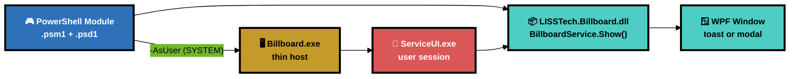
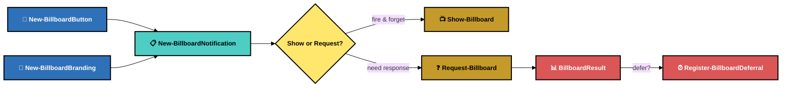

<p align="center">
  
</p>

<p align="center">
  
</p>

<h1 align="center">Billboard</h1>
<p align="center">
  <strong>Native endpoint notifications for Windows and macOS — Arabic/RTL, safe artwork, user input, and animated themes</strong>
</p>

<p align="center">
  <a href="https://www.powershellgallery.com/packages/LISSTech.Billboard"></a>
  
  
  
  
  
</p>

<p align="center">
  <a href="#-quick-start"><b>Quick Start</b></a> · <a href="#%EF%B8%8F-architecture"><b>Architecture</b></a> · <a href="#-powershell-api"><b>PowerShell API</b></a> · <a href="#-notification-types"><b>Types</b></a> · <a href="#-macos-native-host"><b>macOS</b></a> · <a href="#-building"><b>Building</b></a> · <a href="#-project-structure"><b>Structure</b></a>
</p>

---

## 📑 Table of Contents

- [⚡ Quick Start](#-quick-start)
- [🏗️ Architecture](#%EF%B8%8F-architecture)
- [🎮 PowerShell API](#-powershell-api)
- [🎨 Notification Types](#-notification-types)
- [🍎 macOS Native Host](#-macos-native-host)
- [🔨 Building](#-building)
- [📁 Project Structure](#-project-structure)

---

## ⚡ Quick Start

```powershell
# Install from PSGallery
Install-Module LISSTech.Billboard

# Fire-and-forget toast
Show-Billboard (New-BillboardNotification -Type Info `
    -Title 'Chrome Updated' `
    -Message 'Google Chrome has been updated to version **131.0.6778**.' `
    -Branding (New-BillboardBranding 'Contoso IT'))

# Modal that waits for user response
$result = Request-Billboard (New-BillboardNotification -Type Question `
    -Title 'Restart Required' `
    -Message 'A security update requires a restart.' `
    -Buttons @(
        New-BillboardButton 'Restart Now' -Value restart -Style Primary
        New-BillboardButton 'Remind in 4 Hours' -Value defer -Style Ghost -Defer 4h
    ) `
    -Branding (New-BillboardBranding 'Contoso IT') `
    -Modal)

$result.Value  # "restart" or "defer"
```

---

## 🏗️ Architecture



| Layer | Role | Details |
|-------|------|---------|
| 🎮 **PowerShell module** | User-facing API | Builder cmdlets (`New-Billboard*`) compose configs. Action cmdlets (`Show-Billboard`, `Request-Billboard`) display them. |
| 📦 **DLL** | Core engine | `BillboardService.Show()` manages the WPF Application lifecycle, creates windows, returns results. All UI, models, themes, and resources live here. |
| 🖥️ **Exe host** | SYSTEM bridge | Thin wrapper for ServiceUI scenarios. CLI args → `Show()` → named pipe → exit code. |
| 🔑 **ServiceUI** | Session injection | Microsoft tool that launches processes in the logged-on user's desktop session from SYSTEM context. |

> [!TIP]
> In user sessions, `Show-Billboard` calls the DLL directly — no exe, no pipe, no overhead. The exe path is only used when running as SYSTEM (e.g., Intune remediations, N-central scripts).

---

## 🎮 PowerShell API

### Builder Cmdlets

| Cmdlet | Description |
|--------|-------------|
| `New-BillboardButton` | Create a button with label, value, style (`Primary`, `Ghost`, `Danger`), and optional defer duration |
| `New-BillboardBranding` | Set organization name and optional local or public HTTPS PNG/JPG/GIF logo |
| `New-BillboardInput` | Add one optional, required, or multiline text field to a modal |
| `New-BillboardNotification` | Compose a notification from type, title, message, buttons, branding, input, artwork, theme, and timeout |

### Action Cmdlets

| Cmdlet | Description |
|--------|-------------|
| `Show-Billboard` | Display a notification. Fire-and-forget for toasts, blocks for modals. Use `-AsUser` from SYSTEM. |
| `Request-Billboard` | Display and wait for user response. Returns `BillboardResult` with button, value, defer. |
| `Register-BillboardDeferral` | Schedule a re-show via Windows Task Scheduler after a defer duration. |

### Notification Flow



### Parameters

```powershell
# Button styles: Primary, Ghost, Danger
New-BillboardButton 'OK' -Value ok -Style Primary

# Defer durations: 30m, 1h, 4h, 1d, 7d
New-BillboardButton 'Later' -Value defer -Style Ghost -Defer 4h

# Notification types: Info, Warn, Alert, Critical, Question
# Themes: Auto (default), Light, Dark, StarryNight, WaterLilies, GreatWave
# Timeout: seconds (0 = no auto-dismiss)
$input = New-BillboardInput -Label 'Reason' -Placeholder 'Tell us why' `
    -Required -MaxLength 500
New-BillboardNotification -Type Question -Title 'مطلوب رد' `
    -Message 'أدخل السبب ثم اختر **إرسال**.' -Input $input `
    -Theme StarryNight -Illustration 'https://example.com/art.png'
```

### Result Object

```json
{
  "Button": "Submit",
  "Value": "submit",
  "Index": 0,
  "Input": "typed response",
  "Dismissed": false,
  "Timeout": false,
  "Defer": null,
  "Timestamp": "2026-04-07T23:41:07Z"
}
```

---

## 🎨 Notification Types

| Type | Color | Default Timeout | Use Case |
|------|-------|:-:|-------------|
| 🔵 **Info** | Blue `#2E71B8` | 10s | Software updates, policy changes, FYI notices |
| 🟡 **Warn** | Amber `#C49A2A` | 10s | Low disk space, certificate expiry, non-urgent issues |
| 🟠 **Alert** | Orange `#D4782E` | 15s | Password expiring, compliance deadlines |
| 🔴 **Critical** | Red `#DA5657` | none | Security incidents, endpoint protection disabled |
| 🔷 **Question** | Blue `#2E71B8` | none | Restart required, user decision needed |

Each type has:
- Dedicated **color scheme** (badge, border, accent, card background)
- Unique **badge icon** (info circle, triangle alert, bell, octagon X, help circle)
- Built-in or custom **illustration** from a local file or public HTTPS PNG/JPG/GIF (GIFs render their first frame)
- **Toast** (bottom-right, non-intrusive) and **modal** (centered, full-screen backdrop) modes
- Automatic **Arabic and right-to-left layout** for titles, messages, input, and buttons
- **Light**, **dark**, and animated painting-inspired `StarryNight`, `WaterLilies`, and `GreatWave` themes
- Optional required or multiline **modal user input**, returned as `BillboardResult.Input`

> [!NOTE]
> Message text supports `**bold**`, `*italic*`, `` `code` ``, `- bullets`, `[links](https://...)`, and bare HTTPS URLs. Markdown images render as safe `[Image: alt text]`; they never fetch content.

---

## ⚙️ Exe Host

For SYSTEM/ServiceUI scenarios where the notification must appear in the user's desktop session:

```bash
# Basic toast
Billboard.exe --type info --title "Update" --message "New version available"

# Modal with buttons, defer, and pipe for IPC
Billboard.exe --type question --title "Restart?" --message "Save work" \
  --buttons "Restart Now:restart:primary;Later:snooze:ghost:defer=4h" \
  --modal --pipe Billboard.abc123

# Exit codes: 0=button clicked, 1=dismissed, 2=timeout, 100=error
```

The PowerShell module handles this automatically with `-AsUser`:

```powershell
# From a SYSTEM-context script (e.g., Intune remediation, N-central automation)
Show-Billboard $notification -AsUser
$result = Request-Billboard $notification -AsUser
```

For `-AsUser`, the module serializes the complete CLI argument vector into one
Base64 `--payload` token before invoking ServiceUI. This avoids reparsing
notification text at the `Start-Process → ServiceUI.exe → Billboard.exe`
boundaries and preserves spaces, line breaks, quotes, punctuation, Unicode, and
trailing backslashes.

## 🍎 macOS Native Host

The native macOS implementation lives in `src/LISSTech.Billboard.Mac`. It uses SwiftUI/AppKit on macOS 13 or newer and implements the same notification types, modal/toast layouts, input, RTL text, safe rich text and artwork, and painting-inspired themes without shipping a .NET runtime.

Install the signed package to place:

- `/Applications/LISSTech Billboard.app`
- `/usr/local/bin/lisstech-billboard-rmm`

Configuration is JSON. Keys may be camel case, snake case, or Pascal case; enum values are case-insensitive. `defer` is expressed in seconds.

```json
{
  "type": "question",
  "title": "Restart required",
  "message": "A security update is ready. Save your work.",
  "modal": true,
  "theme": "starryNight",
  "illustration": "https://cdn.example.com/restart.png",
  "branding": {
    "name": "Contoso IT",
    "logo": "/Library/Contoso/logo.png"
  },
  "input": {
    "label": "Reason",
    "placeholder": "Optional note",
    "maxLength": 500
  },
  "buttons": [
    { "label": "Restart now", "value": "restart", "style": "primary" },
    { "label": "Later", "value": "defer", "style": "ghost", "defer": 14400 }
  ]
}
```

Run directly in the logged-in user session:

```bash
"/Applications/LISSTech Billboard.app/Contents/MacOS/LISSTechBillboardMac" \
  --config /path/to/notification.json
```

Run from an RMM agent or LaunchDaemon executing as root:

```bash
result="$(/usr/local/bin/lisstech-billboard-rmm \
  --config /path/to/notification.json \
  --wait-seconds 3600)"
status=$? # 0=button, 1=dismissed, 2=timeout, 100=error
```

The helper resolves the active console user, launches the app in that user's bootstrap namespace, and returns the result through a root-created FIFO owned only by that user. It fails closed when no interactive console user exists. Result JSON uses lowercase keys and includes `button`, `value`, `index`, `input`, `dismissed`, `timeout`, `defer`, and `timestamp`.

For stdin automation, pass `--json`. For argument-safe transport, pass Base64 JSON with `--payload`.

---


## 🔨 Building

Requires: [just](https://github.com/casey/just), .NET SDK (targets .NET Framework 4.7.2).

```bash
just              # list all recipes
just build        # 🔨 build DLL + exe (Debug)
just test         # 🧪 run Windows xUnit tests
just smoke        # 🔍 visual smoke test — 20 variants via PS module
just release      # 🚀 test → build Release → sign (EV cert)
just publish      # 📤 release + publish to PSGallery
just bump         # 🔖 bump CalVer (YY.DOY.patch)
just clean        # 🧹 remove Release/ and obj/
```

Native macOS builds require macOS 13+, Xcode Command Line Tools, and Swift 5.9+:

```bash
just mac-test                       # Swift contract tests
VERSION=1.0.0 just mac-build        # universal arm64 + x86_64 app/helper
just mac-package 1.0.0              # installer package
scripts/notarize-macos.sh Release/macOS/LISSTech-Billboard-1.0.0.pkg
```

`mac-build` uses ad-hoc signing for local testing. Set `MACOS_APP_IDENTITY` to a Developer ID Application certificate and `MACOS_INSTALLER_IDENTITY` to a Developer ID Installer certificate for distribution. Notarization accepts `MACOS_NOTARY_PROFILE`, or `APPLE_ID`, `APPLE_TEAM_ID`, and `APPLE_APP_PASSWORD`.

### Release Pipeline

```mermaid
%%{init: {'theme': 'base', 'themeVariables': {'fontFamily': 'monospace', 'fontSize': '13px', 'primaryBorderColor': '#000', 'lineColor': '#000'}}}%%
graph LR
    A["🧪 test"] --> B["📦 assemble"]
    B --> C["🔏 sign"]
    C --> D["🚀 release"]
    D --> E["📤 PSGallery"]

    classDef mint fill:#4ECDC4,stroke:#000,stroke-width:2px,color:#000,font-weight:bold
    classDef blue fill:#2E71B8,stroke:#000,stroke-width:2px,color:#fff,font-weight:bold
    classDef amber fill:#C49A2A,stroke:#000,stroke-width:2px,color:#000,font-weight:bold
    classDef red fill:#DA5657,stroke:#000,stroke-width:2px,color:#fff,font-weight:bold
    classDef green fill:#C7F464,stroke:#000,stroke-width:2px,color:#000,font-weight:bold

    class A mint
    class B blue
    class C amber
    class D red
    class E green
```



### Module Output

```
📦 Release/LISSTech.Billboard/
├── 📂 Assembly/
│   ├── 📦 LISSTech.Billboard.dll
│   ├── 📦 System.Text.Json.dll
│   └── 📦 (dependency DLLs)
├── 📂 Bin/
│   ├── 🖥️ Billboard.exe
│   ├── ⚙️ Billboard.exe.config
│   └── 🔑 ServiceUI.exe
├── 📄 LISSTech.Billboard.psd1
└── 📄 LISSTech.Billboard.psm1
```

### Environment Variables

Configure via `.env` file (see `.env.example`):

| Variable | Required | Description |
|----------|:--------:|-------------|
| `CODE_SIGNING_CERTIFICATE_THUMBPRINT` | ⬜ | SHA-1 thumbprint from Windows certificate store. Omit to skip signing. |
| `PSGALLERY_API_KEY` | ⬜ | NuGet API key for [PSGallery](https://www.powershellgallery.com/account/apikeys). Required for `just publish`. |
| `MACOS_APP_IDENTITY` | ⬜ | Developer ID Application identity used for the native app and helper. |
| `MACOS_INSTALLER_IDENTITY` | ⬜ | Developer ID Installer identity used for the `.pkg`. |
| `MACOS_NOTARY_PROFILE` | ⬜ | `notarytool` keychain profile; preferred over Apple ID environment variables. |
| `MACOS_KEYCHAIN` | ⬜ | Path to the local keychain that stores the notary profile; no password or key material is exported. |

### Forgejo Signed Packages

The manual `release-sign` workflow builds the same immutable commit on two repository-scoped, capacity-one host runners:

| Package | Runner labels | Local signing material |
|---------|---------------|------------------------|
| Windows | `windows`, `billboard-windows-CST-ISLAB-PC3` | LISS Authenticode certificate in the Windows certificate store; the runner exposes only `CODE_SIGNING_CERTIFICATE_THUMBPRINT`. The hardware-token PIN must never be stored in Forgejo or a runner environment variable. |
| macOS | `macos`, `billboard-macos-CST-ISLAB-MAC2` | Developer ID Application and Installer identities in `/Users/ltac-ci/Library/Keychains/lisstech-release.keychain-db`, plus the `ltac-notary` notarytool profile. No certificate, private key, P12, Apple password, or notary credential is exported to Forgejo. |

Dispatch `.forgejo/workflows/release-sign.yml` from protected `trunk` or a protected `v*` tag. Supply the full commit object ID as `expected_commit` and the exact `ModuleVersion` as `version`. Both jobs reject a mismatched ref, commit, version, host, or signing identity; verify the signatures and timestamp/notarization before uploading 30-day artifacts and SHA-256 checksums.

Runner state is isolated under `C:\ForgejoRunners\billboard-windows` and `/Users/ltac-ci/ForgejoRunners/billboard-macos`. Restart the services with `Restart-Service LISSTechBillboardForgejoRunner` on Windows and `sudo launchctl kickstart -k system/com.lisstech.forgejo-runner.billboard` on macOS. Rotating a runner token requires deleting its `.runner` file, issuing a replacement repository-scoped registration in Forgejo, and restarting only that platform's service. Unlock the dedicated macOS keychain locally after a host reboot; do not automate that password through Forgejo.

---

## 📁 Project Structure

```
📦 LISSTech.Billboard
├── 📂 src/
│   ├── 📂 LISSTech.Billboard/               # 📦 Class library (DLL)
│   │   ├── 🎯 BillboardService.cs            #   Static Show() API + WPF lifecycle
│   │   ├── 📂 Models/                        #   BillboardConfig, ButtonDefinition, BrandingConfig, BillboardResult
│   │   ├── 📂 Services/                      #   CliParser, PipeServer, MarkdownParser, ImageService
│   │   ├── 📂 Controls/                      #   NotificationCard (WPF UserControl)
│   │   ├── 📂 Views/                         #   ToastWindow, ModalWindow
│   │   ├── 📂 Themes/                        #   Colors.xaml, Typography.xaml, Buttons.xaml
│   │   ├── 📂 Assets/Icons.xaml              #   Badge icon geometries
│   │   ├── 📂 Assets/Fonts/                  #   Inter font family (TTF)
│   │   ├── 📂 Assets/Illustrations/          #   Per-type illustrations (dark + light PNGs)
│   │   └── 📂 Assets/Brand/                  #   LISS logo
│   ├── 📂 LISSTech.Billboard.Host/          # 🖥️ Thin Windows exe host
│   │   └── 🎯 Program.cs                     #   CLI → BillboardService.Show() → pipe
│   └── 📂 LISSTech.Billboard.Mac/           # 🍎 Native SwiftUI app and root RMM helper
│       ├── 📂 Sources/                        #   Shared core, app, helper
│       └── 📂 Tests/                          #   macOS XCTest contracts
├── 📂 tests/
│   └── 📂 LISSTech.Billboard.Tests/         # 🧪 Windows xUnit tests
├── 📂 vendor/                                # 🔑 ServiceUI.exe
├── 📂 scripts/                               # 🛠️ Screenshot and macOS build/package/notarize scripts
├── 📄 LISSTech.Billboard.psm1               # 🎮 PowerShell module script
├── 📄 LISSTech.Billboard.psd1               # 📋 PowerShell module manifest
├── 📄 justfile                               # 🔨 Build recipes
├── 📄 .env.example                           # 🔐 Environment variable template
└── 📄 CLAUDE.md                              # 🤖 AI coding instructions
```

---

## 🔒 Safety & Signing

| Measure | Details |
|---------|---------|
| 🔏 **EV code signing** | DLL, exe, psm1, and psd1 are signed with a LISS Consulting EV certificate via DigiCert |
| 🛡️ **No focus theft** | Toasts use `WS_EX_NOACTIVATE` — they appear without stealing focus from the active window |
| 🔒 **Internal pipe** | `PipeName` is `internal` — only the exe host can set it, not external callers |
| 🍎 **macOS user bridge** | Root creates a mode-0600 FIFO owned by the active console user; the GUI verifies FIFO type and ownership before writing. |
| 📋 **Rich text safe** | Only HTTP/HTTPS links become clickable; Markdown images render alt text and never fetch |
| 🖼️ **Remote image limits** | Public HTTPS only; private/local networks, credentials, redirects to blocked hosts, non-PNG/JPG/GIF data, files over 8 MB, oversized dimensions, and excessive GIF frames are rejected |

---

<p align="center">
  <a href="https://www.powershellgallery.com/packages/LISSTech.Billboard"></a>
  
  
  <br/><br/>
  
  <br/>
  <sub><strong>LISS Consulting, Corp.</strong> · <em>Endpoint notifications that don't suck.</em></sub>
  <br/>
  <sub><a href="https://storyset.com">Illustrations by Storyset</a></sub>
</p>
